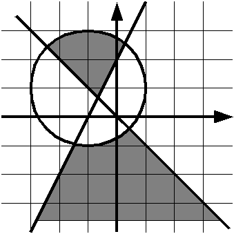

# Принадлежит ли точка области

>Проверьте, принадлежит ли точка данной закрашенной области:
> 
> Если точка принадлежит области (область включает границы), выведите слово YES, иначе выведите слово NO. Решение должно содержать функцию IsPointInArea(x, y), возвращающую True, если точка принадлежит области и False, если не принадлежит. Основная программа должна считать координаты точки, вызвать функцию IsPointInArea и в зависимости от возвращенного значения вывести на экран необходимое сообщение. Функция IsPointInArea не должна содержать инструкцию if.
> 
> 
> 
> 

## Формат ввода

Вводится два действительных числа.

## Формат вывода

Выведите ответ на задачу.

## Замечание

 В задаче подразумевается, что нижняя область продолжается вниз  бесконечно (картинка может ввести в заблуждение, как будто область  заканчивается на y = -3.5). Т.е. например для ввода

 ## Примеры

>
>### **Тест 1**
>
>>*Входные данные:*
>>
>> -4
>>
>> -4
>>
>> 
>> 
>> 
>>
>> 
>>
>> 
>>
>> 
> 

>>*Вывод программы:*
>>
>> NO
> 

>### Тест 2
>
>>*Входные данные:*
>>
>> 
> >
>>
>> 
>> -4
>>
>> -3
>>
>> 
>>
>> 
> 
>>*Вывод программы:*
>>
>> NO
> 
> 
> >### Тест 3
>
>>*Входные данные:*
>>
>> -4
>>
>> -2
>> 
>> 
>>
>> 
>>
>> 
>>
>> 
> 
>>*Вывод программы:*
>>
>>NO