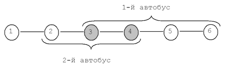

# Пересадки

>На Новом проспекте для разгрузки было решено пустить два новых автобусных маршрута на разных участках проспекта.  Известны конечные остановки каждого из автобусов. Определите количество остановок, на  которых можно пересесть с одного автобуса на другой.

## Формат ввода

Вводятся четыре числа, не превосходящие 100, задающие номера конечных остановок. Сначала для первого, потом второго автобуса (см. примеры и рисунок).

## Формат вывода

Ваша программа должна выводить одно число – искомое количество остановок.

## Примечание.

Пояснения Первый пример (см. рисунок): первый автобус ходит с 3-й остановки по 6-ю и обратно, а второй с 2-й по 4-ю и обратно. Пересесть с одного автобуса на другой можно на 3-й и 4-й остановках. Их две. Второй пример: автобусы не имеют общих остановок.

 ## Примеры
>
>>### Тест 1
> 
>>*Входные данные:*
>>
>>3 6 4 2
>>

>>*Вывод программы:*
>>
>>2

>### Тест 2
>>
>>*Входные данные:*
>>
>>3 1 5 10
>>
>>

>>*Вывод программы:*
>>
>>0
